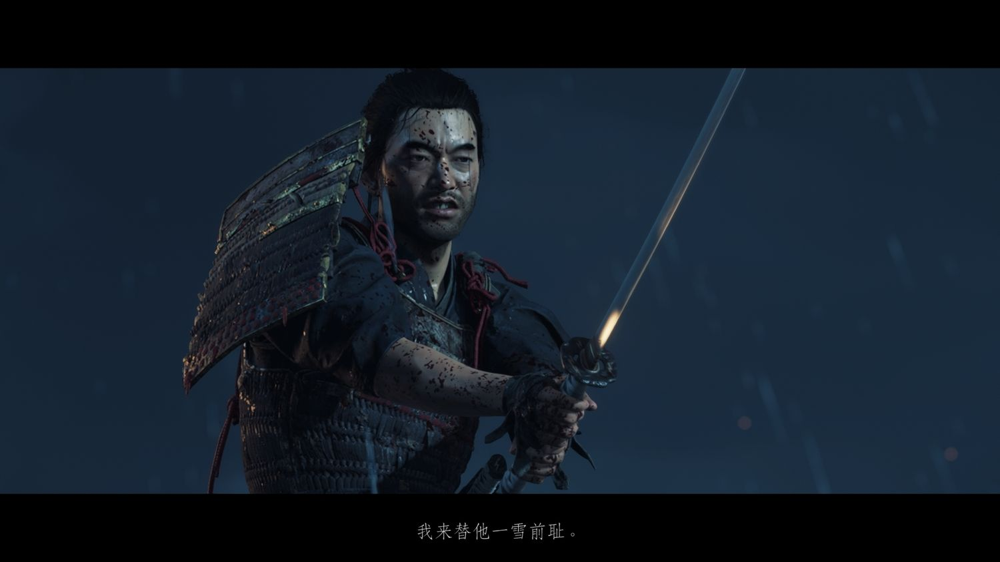
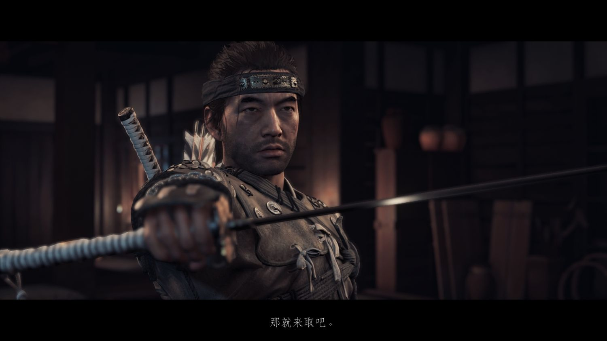
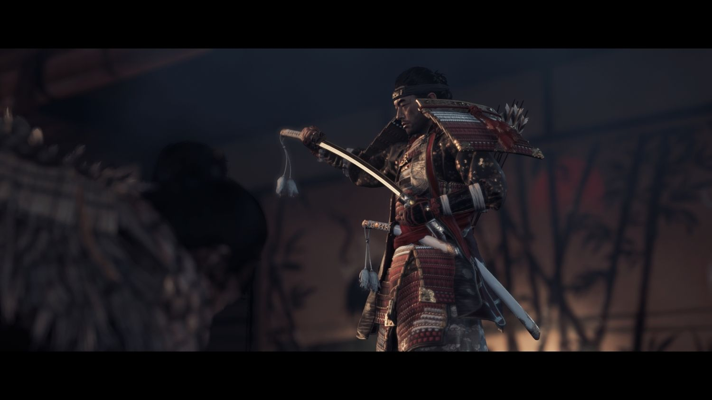
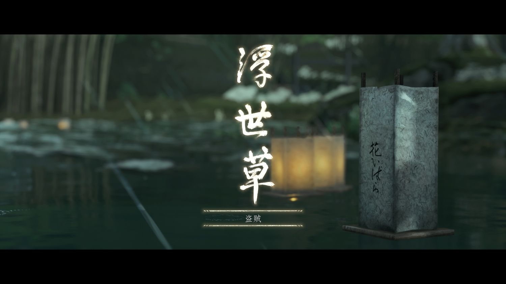
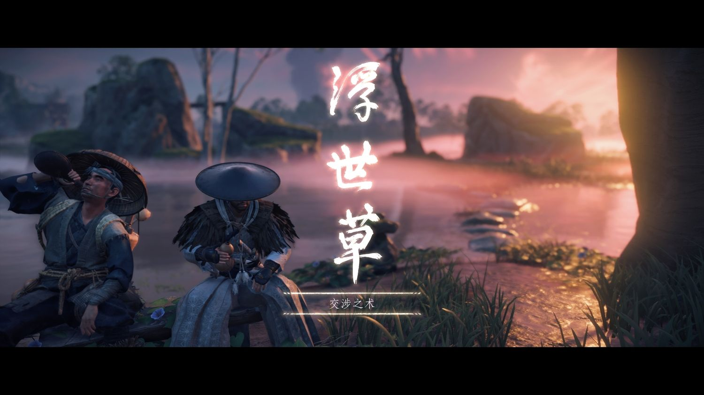
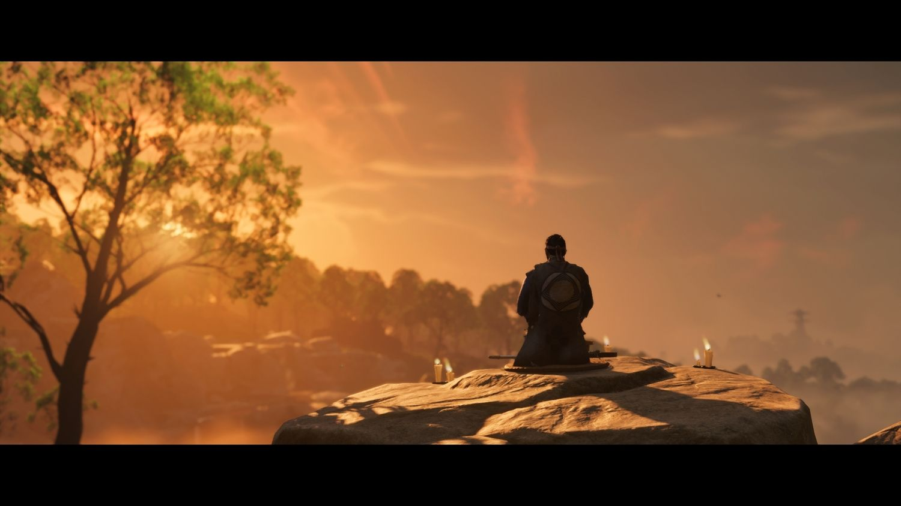
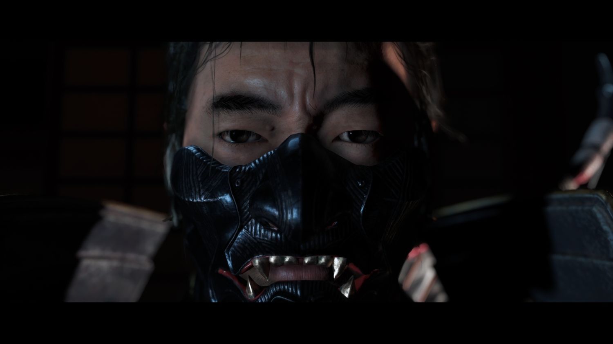
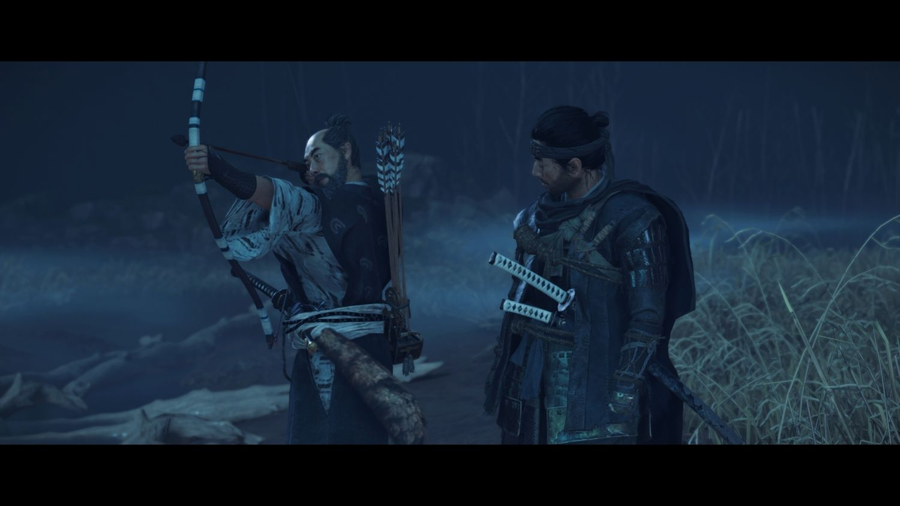

终于是花了两三周时间把 ~~对蒙忍~~ 对马岛之鬼白金了。总体非常满意游戏的质量，而且本作可谓是 PS4 末期的诚意之作，觉得还是有必要稍稍简评。

<!--more-->

## 总体评分：9 分

### 剧情：7.5 分

个人认为不功不过，叙事完整，起承转合都可以接受 ~~至少不会没由头地对着重要人物来一发高尔夫球棒~~。从武士到战鬼的缘由、坚持战鬼之道及其后果，都讲得算是比较明确了。简要总结一下就是“一个理想主义者的死亡”，也侧面了反映骑士精神/武士道为何在火枪火炮面前毫无还手之力。

当然，剧情一股育碧味儿，查阅资料后发现确实是几位从育碧跳槽出来的编剧写的……

还有，主线剧情的演出非常精彩，这点后面讲。

### 演出：9 分

这应该是本作最突出的特点了。从一开始就有选项选择黑泽明模式（高对比黑白+噪点），致敬大师和经典武士电影。从主线剧情人物的动作及表情，决斗前拔刀的镜头 ~~还挺西部片的~~，再到每个故事开头的定格镜头，总的来说运镜水平以及画质渲染足以暴打大部分游戏了。牛逼疯了。

如果想要完整体验 GoT 的画质和运镜水平，建议用 PS4 Pro+4K HDR 显示器/电脑玩 ~~或者等上 PC 体验极致画质~~。我只有初代 PS4，只能输出 1080p，比较可惜。

### 操作：7 分

操作应该时本游戏的短板，很多细节差点毁掉这款游戏。这并不是说笑，开门时过于贴近导致无法按 R2 开门、连续暗杀时因为前冲了一步导致判定为重攻击、骑马时对敌方的会心一击难以触发，还有攀登神社时绳钩经常勾不到……这些小毛小病导致在整个 Gameplay 过程中充满了各种各样的不爽感，如果不是杀阵演出真的很爽很流畅，那我可能会半路弃坑了。

在决斗时，挥刀的手感还算是不错的，弹反的判定在装了水神护符后松了很多，然而非常奇怪的是我几乎没用出过完美闪避，经常就变成滚地了……可能还需要多练习吧，普通难度通关基本靠弹反。

### 地图与探索：8 分

地图分为三个部分，随着收复主要城池开放，没有特别安排空气墙而是编排好地形来阻挡探索。狐狸巢、神社、温泉的分布总体比较合理，几个探索点之间的距离不会太夸张。此外在野外营救到被绑的百姓会逐渐把蒙古据点和占领的镇子标出来，在完成主线前就可以把大部分地图开完。

支线任务很多也是从流民营地对话接到的，而且据说是就近刷的，这样的机制也是挺不错的，至少揍到哪儿基本就可以探索到哪儿。

唯一比较不满的是探索收益偏低了一些，大部分都是给的资源；任务给的护符大部分都是重复的，仅有稻荷神社的两个护符可以随着探索增长。

## 部分截图展示

## 鸣谢

感谢老马 ([twitter: @bgm38](https://twitter.com/bgm38)) 全程协助帮忙搭起这个小博客！

另，本博客思考再三后决定不开放评论功能，如有疑问请[邮件联系](mailto:aozaki.kuro@gmail.com)。
