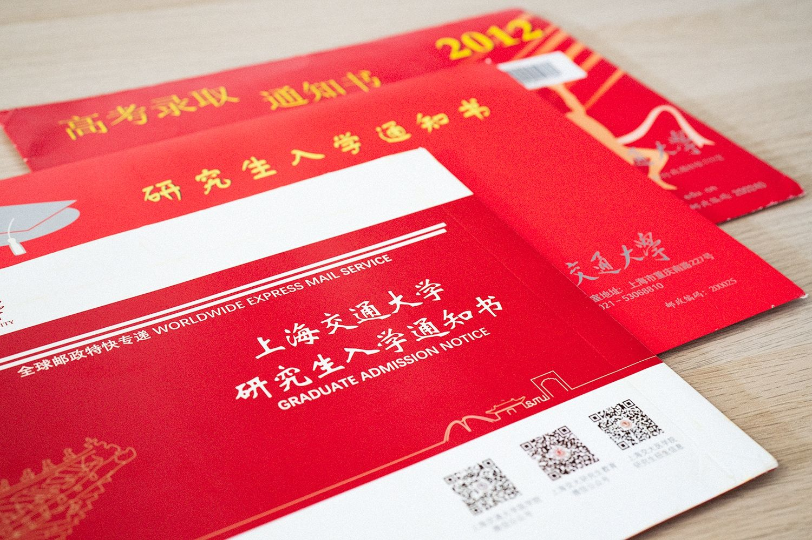
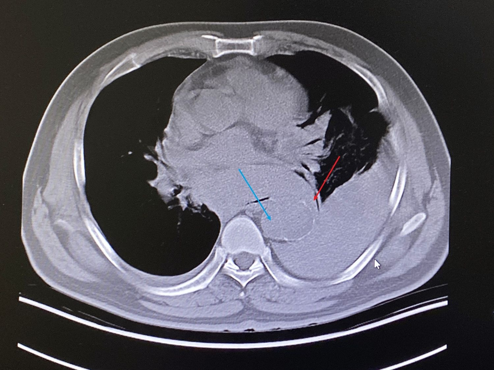
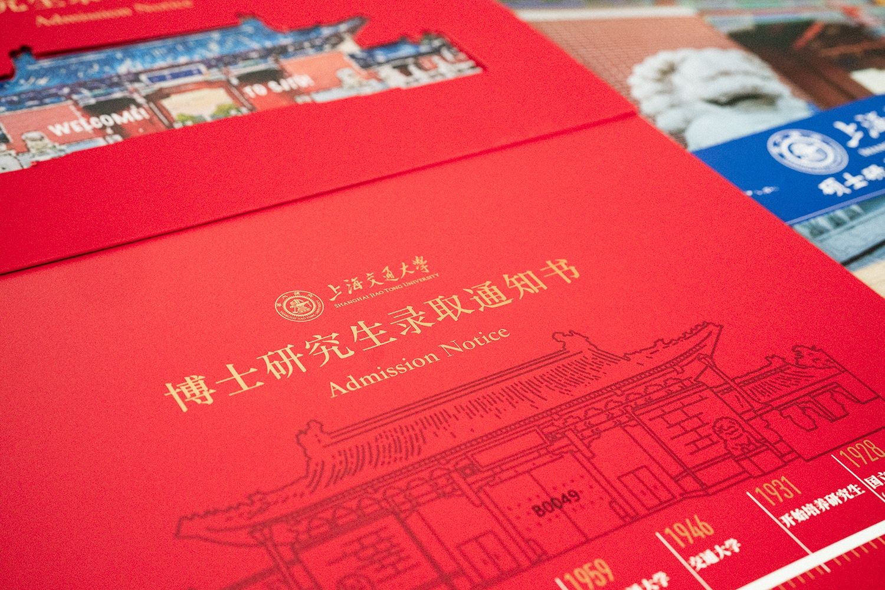

总算是毕业了，怎么说呢，准备好从一个火坑到一个火坑。

<!--more-->

## 漫长的轮转

2017年到2020年一直在临床上轮转，某三甲医院的轮转计划是真的狠，从2017年8月1日到2020年7月31日用了个彻底，市里规定33个月的轮转硬给扩展到了36个月。

算了算各个科室轮转月数，心脏内科（5）、呼吸科（4）、消化科（4）、肾脏内科（2）、内分泌科（2）、麻醉科（2）、急诊科（2+1）、感染科（2）、风湿免疫科（2）、神经内科（2）、高血压科（2）、精神科（2）、血液科（2）、影像科（2）。

当然所有临床学的技能、学的知识全靠自己，哪来的老师给你一个个讲过去呢（苦笑）。倒是在很多同学抱怨单调、太累的麻醉科学到了很多东西。除了前两周在普外科房间做麻醉以外，剩下时间都在心外科麻醉台面工作，学习了气管插管、有创动脉监测、深静脉置管、右心漂浮导管置管、固定呼吸机及转运呼吸机的使用、大抢救，等等等等。以至于后面一个科室到ICU时被主任询问是否是外科出身，对不起，我是一个曾经想做外科的心内科医生……

## 疫情

今年年初还遇上了新冠疫情，要不是疫情最严重2月到3月窝在一个闲得要死的科室把毕业论文写完了，真不知道拿什么来毕业。当时在神经内科等等科室，因为回乡的轮转医生回不来，实习学生和进修医生无法来沪，于是我们这些最后坚守的轮转医生们每3-4日就是一个值班，忙得非常刻骨铭心了。

还有支援门急诊时都需要穿戴非常厚重的防护服，这对于我一个容易出汗的人来说简直是灾难，每天脱下来的衣服里全都是水。加之中央空调不能开，于是就得在寒冷和湿透了的内层之间挣扎…………

希望疫情能尽早结束。

## 挺多破事

轮转期间当然接触的最多的还是病人，现在医患关系那么紧张，挑一个讲讲吧。

当时在北院急诊台面轮转，从分诊台送来一个中年男性病人（以及好几个家属）。家属张口就是要给病人吸痰。

观察患者捂胸口，大汗淋漓，有咳嗽，呼吸急促，但尚不能确定问题所在。遂嘱平卧至检查床上，测量生命体征。单侧血压86/45 mmHg，对侧122/74 mmHg，四肢厥冷，单侧脉搏细弱，对侧脉搏搏动尚有力。考虑大动脉栓塞或主动脉夹层。

追问患者家属既往是否有心梗、主动脉夹层或相关血管疾病，患者家属**矢口否认**。翻阅门诊病历卡后发现2月前于外院确诊“主动脉夹层”，当时送入心脏外科监护室，由于当时检查考虑DeBakey II/Stanford A型，死亡率极高，建议手术。出于经济原因，患者要求回当地诊治（手术和监护费用粗算约20-40万不等，手术风险也非常高）。谁知患者仍然在沪工作，未回当地手术治疗。

当然要拖去做个CT，考虑到患者病情危重，生命体征不稳，于是没有做增强。

如图所示，蓝色箭头为主动脉夹层形成的假腔，由于病程长达2月，夹层已经可见钙化，无需造影剂也可以看见假腔。红色箭头是主动脉夹层破口，同样由于病程长达2月，加之血管条件差，破口反而并不是很大，但已经在往胸腔内出血了。单侧胸腔容积2500mL，人的全身血量也不过4000mL上下，可以解释为何又大汗淋漓及四肢厥冷的外周循环衰竭征象。

北院由于没有能力进行急诊心外科体外循环手术，告知患者家属病情危重及无法在北院进行手术后，决定签字后转院回当时确诊的医院。

## 顺利毕业

尽管有诸多的不如意和心惊胆战的时刻，总算还是完成了3年的轮转，拿到了学位证、学历证、医师执照、轮转证，顺利达成四证合一的目标。还努力考上了博士，集齐了三张入学通知书。

接下来就是面对博士生涯，还有今后的职业规划了。

……一个火坑到另一个火坑，希望博士能顺利完成吧。