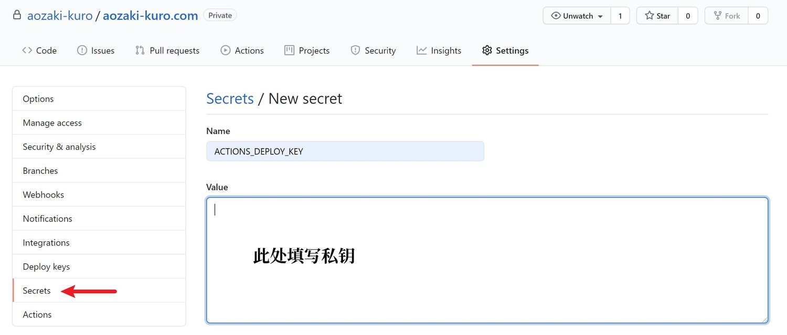
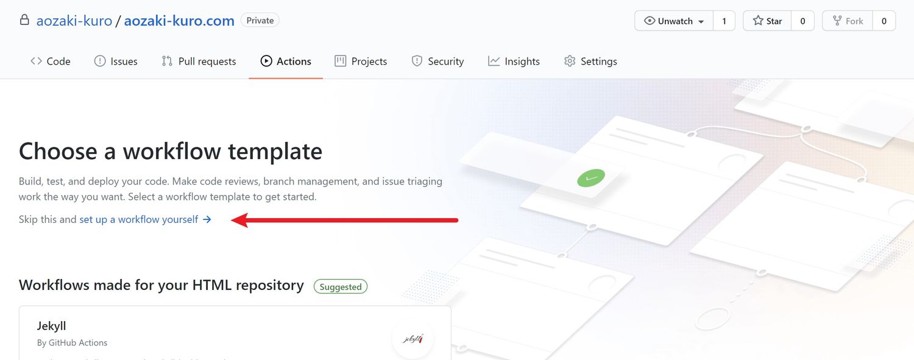

先前抱怨过Hugo本地编译再`git push`至远端的操作过于繁琐，今天发现可以通过Github Action实现对Hugo的自动化部署并实践成功，故记录折腾过程。

<!--more-->

此处应有 从各种意义上来讲这玩意太他妈邪门.jpg

总之因为各种教程都有点语焉不详，于是还是自己把傻瓜化的过程记录下来得了。

## 建立新Respiratory放置博客源文件

~~竟然把Repository（资料库）拼成Respiratory（呼吸道）了，丢人~~

这一步不用说吧，新建后将所有文件添加至新repo里（我用Github Desktop上传的），然后准备进行下一步操作。

## 通过Github Actions进行自动部署

在本地新生成用于两个repo间通讯的SSH KEY

```sh
ssh-keygen -tecdsa
cat ~/.ssh/id_ecdsa.pub #获取公钥
cat ~/.ssh/id_ecdsa. # 获取私钥
```
添加私钥的方法如下


此处因我的私钥变量名定为`ACTIONS_DEPLOY_KEY`，故填写相应名称。

在放置博客源文件的repo里，在Actions中建立Workflow


我的build.yml文件如下

```yml
name: Hugo Build and Deploy
on:
  push:
    branches:
      - master
jobs:
  build-deploy:
    runs-on: ubuntu-latest
    steps:
      - uses: actions/checkout@v1  # v2 does not have submodules option now
        with:
          submodules: true
      - name: Setup Hugo
        uses: peaceiris/actions-hugo@v2
        with:
          hugo-version: latest # 应用最新的hugo
          extended: true # 我的主题需要应用hugo-extende
      - name: Build
        run: hugo --gc --minify
      - name: Deploy
        uses: peaceiris/actions-gh-pages@v3
        with:
          deploy_key: ${{ secrets.ACTIONS_DEPLOY_KEY }} #这里在repo settings里填入SSH私钥
          external_repository: xxxxxxxx/xxxxxxxx.github.io # <- 改成自己的 user github page
          publish_dir: ./public # <- 指定成品放置文件夹
          publish_branch: master # <- 远端repo目标分支
```

随后即可等待自动远端生成站点。

## Github Desktop

对于我这样几乎无Coding基础的用户来说，为了更进一步少敲代码，除了自己写一个批处理文件，也可以应用Github Desktop进行处理。桌面版在[这里下载](https://desktop.github.com/)，在`pull`后即可进行`commit`和`push`操作。唯一需要注意的是，如果之前就用的SSH连接，且仅在WSL内生成过SSH KEY，在Windows下需要再进行一次操作以保证能勾顺利`git push`

## 总结

所以说犯懒是推动发明进步的第一生产力（迫真）

目前是通过Hugo部署在Github Pages上，套了一层Cloudflare CDN，并利用Github Action完成自动化部署；本地则通过Github Desktop简化上传操作。

折腾到现在应该基本达成顺利、顺畅写博客的目的了。~~总感觉有点本末倒置了啊喂~~

***

[](https://github.com/aozaki-kuro/aozaki-kuro.com/actions)