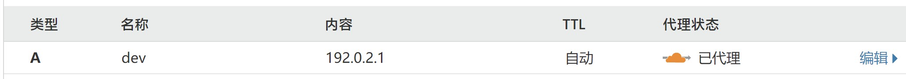

想到迁移到Cloudflare Workers的原因是看到了苏卡卡[**对博客速度进一步优化的文章**](https://blog.skk.moe/post/deploy-blog-to-cf-workers-site/)，觉得Cloudflare Workers这样的Serverless服务非常的酷，而且在短暂的部署尝试中我就感觉到快。

然而迁移后验证了朋友的说法，用用可以，但是把生产环境放上去还是算了。因此总体算是一次不太成功的尝试。由于我没有进一步排障和优化的能力，只能记录一下踩坑记录。

一句话总结：部署时撞到的坑非常非常多，可能比我部署Hugo时遇到的坑还要多。

## 坑1：Wrangler需配置用户

我是利用Github Actions对博客更新进行CI，仅仅是这一步已经出现了大量的bug。

若要部署至Cloudflare Workers，需要应用Wrangler CLI进行部署。本地添加配置、如何填写相关项目可以继续参考[**苏卡卡的文章**](https://blog.skk.moe/post/deploy-blog-to-cf-workers-site/)

然而在Github Actions库中`cloudflare/wrangler-action@1.2.0`，执行时直接报错，查看信息发现`could not determine the current user wrangler`，考虑需要定义`$USER`，查看[**社区讨论**](https://github.com/cloudflare/wrangler-action/issues/12)后发现修改配置文件。

~~修改配置文件时感受到了来自yml深深的恶意~~

最终配置文件如下：
```yml
name: Hugo Build and Deploy
on:
  push:
    branches:
      - master
jobs:
  build-deploy:
    runs-on: ubuntu-latest
    steps:
      - uses: actions/checkout@v1
        with:
          submodules: true
      - name: Setup Hugo
        uses: peaceiris/actions-hugo@v2
        with:
          hugo-version: latest
          extended: true
      - name: Build
        run: hugo --gc --minify
      - name: Deploy to Cloudflare Workers with Wrangler
        uses: cloudflare/wrangler-action@1.2.0
        env:
          USER: root # 非常重要！必须定义
        with:
          # Your Cloudflare API Token
          apiToken: ${{ secrets.CLOUDFLARE_TOKEN }} # 输入你自己定义的secret名称
```

## 坑2：配置完Workers后需要填写DNS记录

这一点是个坑，几乎所有的教程都没有提到这里该怎么填。最后是从Cloudflare Community上翻到的答案（[具体讨论点这里](https://community.cloudflare.com/t/setup-workers-on-personal-domain/88012/7)）。

在指定router后（例如我的是指向`dev.aozaki-kuro.com/*`），只需要在DNS记录内添加一个`A`记录，指向一个空IP即可。

这个空IP可以是`192.0.2.1`以及类似的空IP。



## 坑3：不支持中文路径

尽管苏卡卡在博客中提到了对中文路径的解决，发现也Github上也merge了，但是实际部署后还是无法对`/测试/index.html`这样的路径进行路由。意味着需要放弃博客内对整个中文tags的聚合。这一点是不太能接受的，也是不再继续用下去的原因。

## 总结

Cloudflare Workers仅仅是部署就已经出现了这样那样的坑，官方文档只有简单几行字，很多操作细节根本没有，还别提部署上去后效果也并不是那么理想…………

目前保留了指向Cloudflare Workers的链接，但是不再CI上去，可以参观一下：

https://dev.aozaki-kuro.com/

`Expire date: 2020-09-11`

总之是个坑.jpg