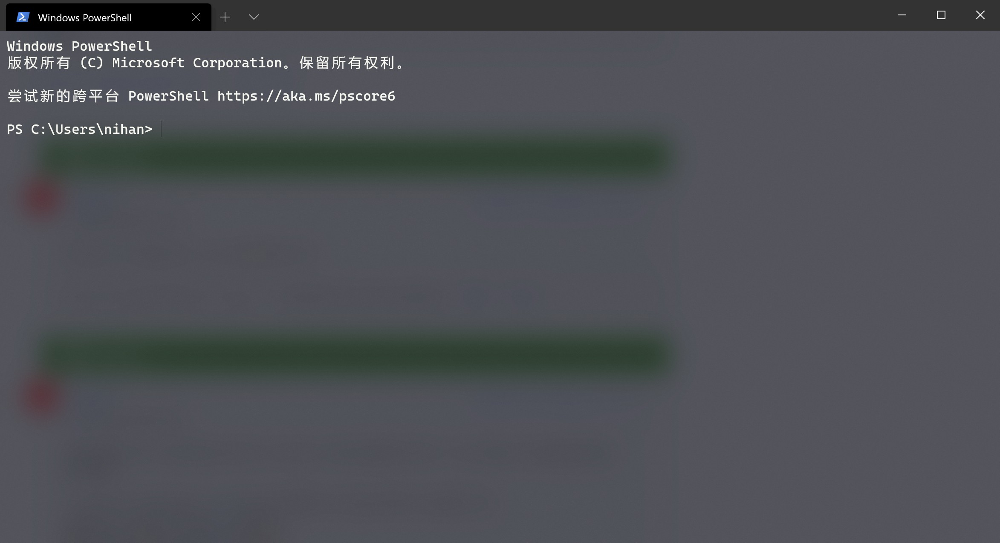

前几日发现新装的 Windows 10 Pro 上，透明效果没有启用。根据各个社区的信息发现这属于挺常见的一个问题，根据社区意见用 DDU 卸载并重新安装过 Nvidia 驱动、调整并复原色彩/分辨率设置均无效，将控制面板中的透明效果关闭再打开也无效。

在寻找多日后在 Microsoft Community 上发现了解决方案，并尝试设置有效，操作记录如下。[原帖：Transparency Effects Not working](https://answers.microsoft.com/en-us/windows/forum/all/transparency-effects-not-working/65321d3e-cb04-4e02-a010-1187d8a81e76)

---

首先`Win+R`运行`regedit`

定位注册表至如下位置：

```
HKEY_CURRENT_USER\SOFTWARE\Microsoft\Windows\CurrentVersion\Themes\Personalize
```

其中一个`DWORD`名称为`EnableTransparency`，首先将其改为`0`。

**关机再开机**，将`EnableTransparency`改为`1`，毛玻璃效果即恢复。[^1]

此处可再关机开机一次，确保设置生效。



---

虽然是一个小小的问题，知道怎么办后解决起来也很快。但是巨硬你能不能上点心，控制面板里的按钮居然是无效的怎么想出来的……

Update：这个问题休眠后启动即会部分复现（Windows Terminal 透明效果仍然有效）。**重新启动**后，以上设置全部失效，得按照上述流程再来一遍。看了下这个问题似乎已经从`1803`开始就有报告[^2]，`1903`也有[^3]，到现在`2004`依然还是存在[^4]。可见得这个 Bug 出现并提交 Microsoft 有段时间了，还是没有修复，我佛了。

[^1]: 实际测试表明此处重新启动不会生效，必须关机-开机。
[^2]: 参见：[Windows 10 Transparency effect is not working](https://answers.microsoft.com/en-us/windows/forum/all/windows-10-transparency-effect-is-not-working/fc22721d-0dd3-4cbd-a0d2-d88479dfd70d)
[^3]: 参见：[Transparency Effect not working in windows 1903](https://answers.microsoft.com/en-us/windows/forum/all/transparency-effect-not-working-in-windows-1903/5d76ae02-7e7e-4093-b8ad-ca8e4084098a)
[^4]: 参见：[Win 10 version 2004 Start Menu transparency](https://answers.microsoft.com/en-us/windows/forum/all/win-10-version-2004-start-menu-transparency/1caec6b3-6026-4b45-a655-68b7173c41f4)
