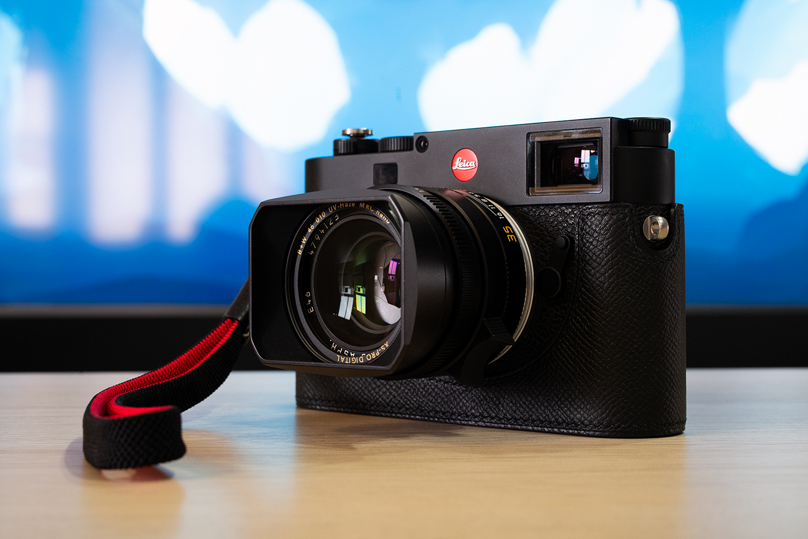

作为“资深”器材党，一直以来徕卡就仿佛遥不可及的梦，久久萦绕在我心头。

这两年由于家母也燃起了摄影之魂，于是变成与家母一起烧摄影器材和拍照了。由于今年疫情原因，国外旅行计划全数取消，自然是多出了非常多资金来购买摄影器材。在我的撺掇之下，家母与我一起出资购买了LEICA M10-R和两枚镜头。

* LEICA M10-R Black Chrome Finish
* LEICA SUMMILUX-M 35mm f/1.4 ASPH FLE (11663)
* LEICA SUMMILUX-M 50mm f/1.4 ASPH (11891)
* TECHART LM-EA7
* Artisan & Artist ACAM-313N Professional Silk Hand Strap
* Kontice Order Made EPSOM Leather Case

选择M10-R的理由，除了是今年新发售的机身，更新的CMOS以及更高的像素都为创作提供了巨大的空间。尤其是不用再特意担心高感问题。尽管个人对那个高调的可乐标不甚满意，但是再那么大创作空间面前便是选择了妥协。

主要考虑到手中还有A7R3，所以同时购买了天工LM-EA7自动对焦环以将M头转接至A7R3上。当然不得不说这也是一个国产黑科技，不大的接环实现了M头的自动对焦，甚至可以通过二次转接盘活更多型号的老旧手动对焦头。

")

而11663和11891自不必多说。徕卡的35mm、50mm是各种意义上的看家焦段，而这两枚现行版镜头也是拥有着极佳素质。之前曾经考虑过是否要去淘一支11874双非，不过最后在“买新不买旧”的原则面前败退下来了。而11891拿到后立刻转接至A7m3上拍摄了上面这张照片。尽管100%放大后，11891的16岁高龄的光学设计已然难以喂饱A7R3和M10-R这两块4000万级别的CMOS，但是这又何妨呢？稍微缩一缩图，这画面依然油润又不失锐利。

***

在背带方面纠结了很久，一方面是在AA真丝系列高昂的价格面前略有迟疑，另一方面，手中仿制AA的登山绳背带在M10-R的实际使用中只让我觉得碍事。于是最后选定了ACAM-313N这根真丝腕带，一方面不破坏原有握持感，另一方面也是因为它较为年轻的红黑配色，非常有特色。

皮套来自于Kontice Leather。由于是黑色机身，填写定制订单时便想着要保持低调，所以面料选择了EPSOM掌纹，并且要求制成底部可换电池的版本。皮套到手后便感受到了与普通皮料截然不同的手感和做工，确实非常对得起它高昂的价格，并且与机身浑然天成。

***

只是才拿到机器不久，片子还不多。今后有更新的话会直接放在[Portfolio](https://aozaki-kuro.com/portfolio/)栏目下。不过首先会将以往的片子逐渐整理出来，算是对2014年至今自己拍摄的一个总结，并且希望能开启新的风格。