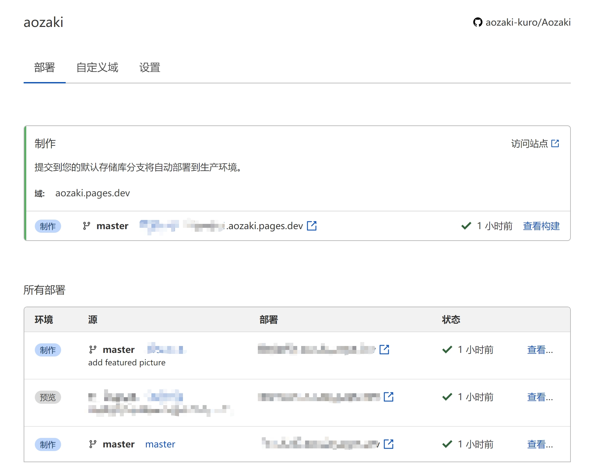

## 曾经的折腾

如果先前有看过我或搜索过我的博客的朋友可能知道，我经历了非常痛苦的Hexo→Hugo过程。并且由于[Github Actions需要自行编写](/deploying-hugo-with-github-actions/)，这个问题着实令人非常头痛。

之前也尝试过[将博客部署到Cloudflare Workers](/migrating-blog-to-cloudflare-workers/)，不过由于并未改善的连接速度以及对中文路径的超烂支持，因此放弃。

然而但是即便是套了Cloudflare CDN的Github Pages的表现也是并不尽如人意，因此一度考虑过自己租服务器建站等等。结果迫于时间原因，并没有最后执行下去。

## Cloudflare Pages来了

在经历了数月的测试后，Cloudflare Pages在2020年12月17日宣布公测[^1]。内测时便听闻Cloudflare Pages的表现不错，随着昨天将整个博客重构，也尝试将博客迁移到CF上。

整个过程其实相当平滑顺畅，并没有什么太大的问题。

## 迁移过程



本文仅作粗略介绍，建议阅读Cloudflare官方的[文档](https://developers.cloudflare.com/pages/how-to/deploy-a-hugo-site)





注意，你的repo名称将会决定子域的名称。



如果已经在Github上建立了一个repo用于存放站点源码，那么接下来的事情实际上非常、非常简单。

### 启用Pages

从账户Dashboard的右侧找到Pages，点击进入。~~中文面板这里是“网页”，属实非常难找。~~

随后点击开始设置，随后在`构建设置`中，找到`框架预设`，选`Hugo`。其他选项都不用动。

但是由于Cloudflare Pages默认的`Hugo`版本只有`0.54.0`，因此常常会在构建中出错。

查阅[社区提问](https://community.cloudflare.com/t/cloudflare-pages-hugo-version-outdated/247215)后发现，需要在`环境变量`中设置`HUGO_VERSION`为`0.81.0`（请根据目前[发行状况](https://github.com/gohugoio/hugo/releases)选择对应版本）。

点击提交后便会开始自动构建，这一过程我们都不用管。

### 绑定域名

点击上图界面中的“自定义域”，如果该域名已经托管在Cloudflare，仅需输入域名（例如`aozaki-kuro.com`），则可以让Cloudflare自动更新`CNAME`并部署。

极度傻瓜化的操作，比起需要自己编写`yaml`的Github Actions不知道高到哪里去了。

## 体验

快，真的很快，`TTFB`不知道下降了多少。虽然图片加载还是略微有些卡顿。

和Github Actions/CI同样的自动部署体验，但是有着更傻瓜化的操作，并且能够利用Cloudflare全球数据中心的网络，我为什么还要继续用Github Pages？

[^1]: 原文链接[点此](https://blog.cloudflare.com/cloudflare-pages/)
