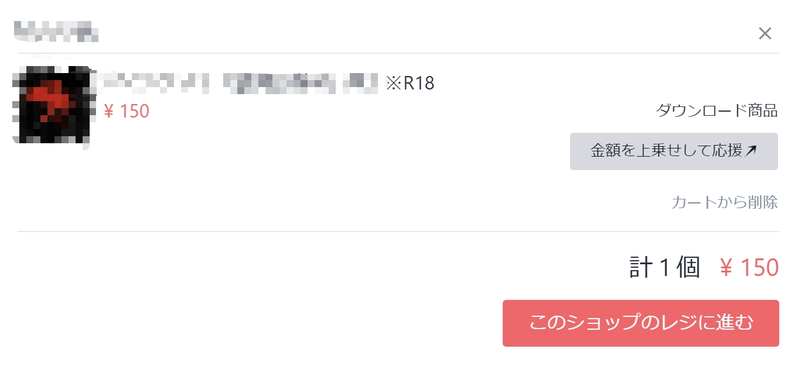
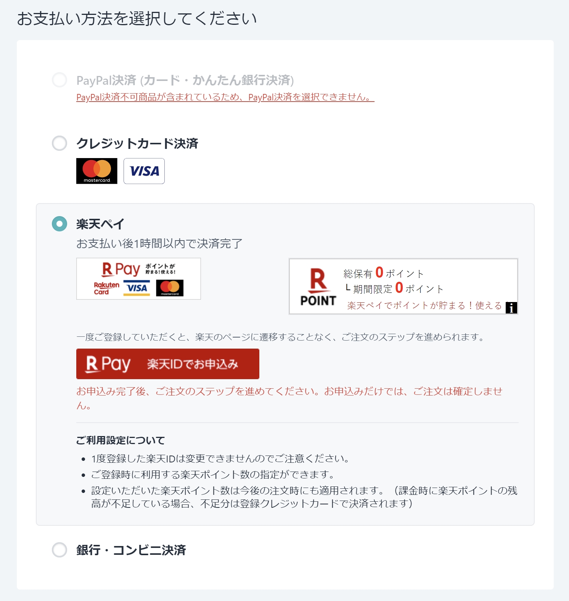
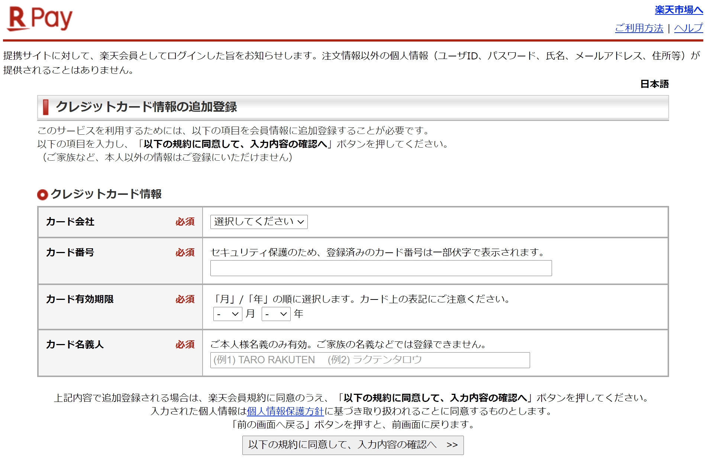
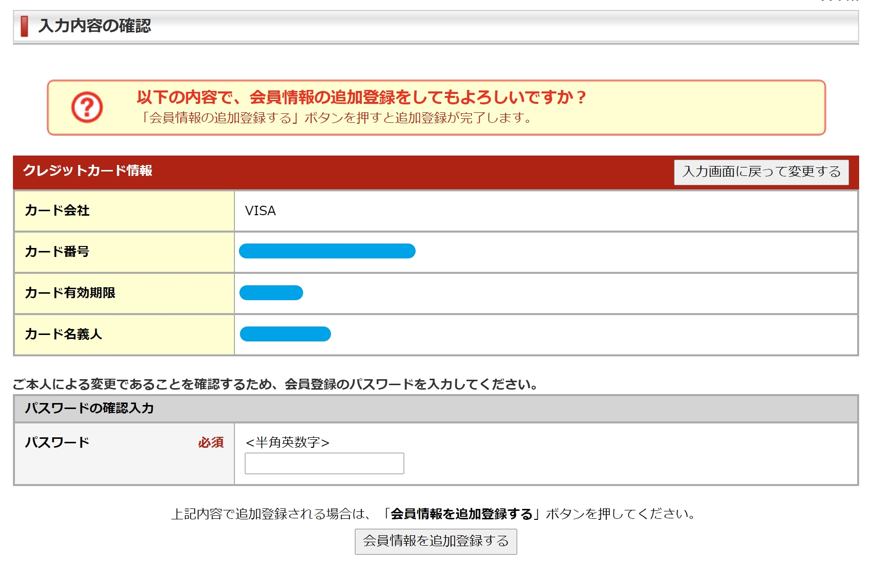
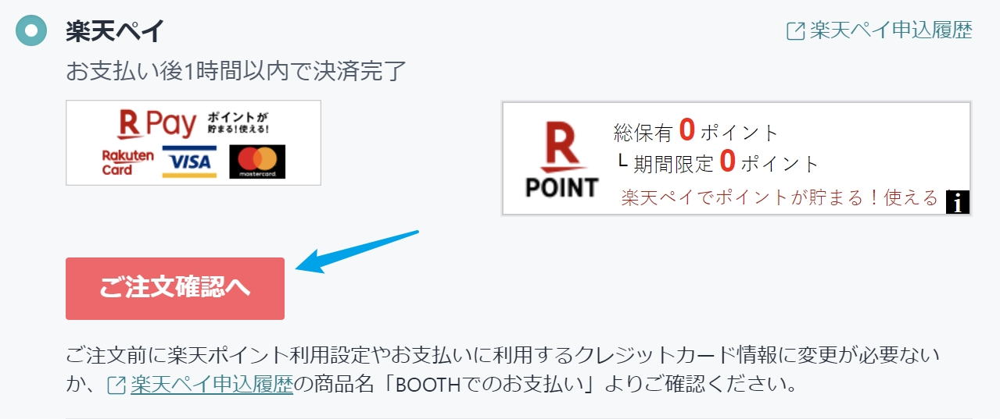
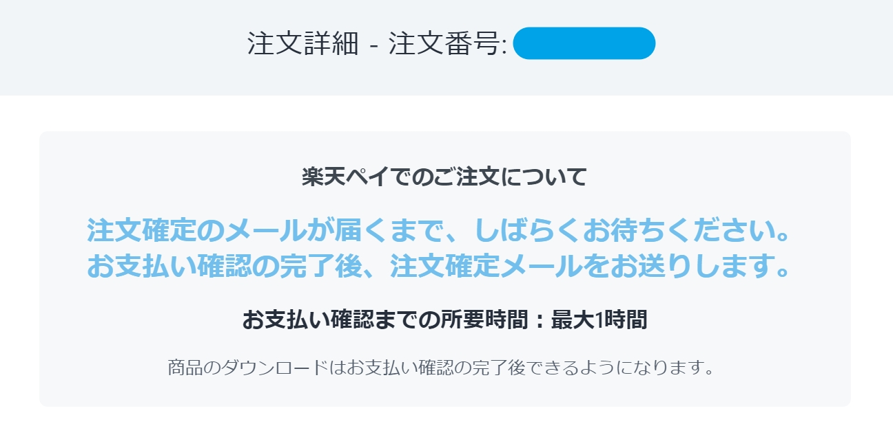



作者仅介绍一种支付方式，请读者**遵守当地法律法规**，注意交易安全。

本文作者不对滥用引起的支付途径失效、信用卡风控、信用卡盗刷等等问题负责





BOOTH在3月16日发表[新公告](https://booth.pm/announcements/507)，可能对部分交易进行风控。对本文采用方法的影响未知。



## Booth的糟糕体验

其实我很想直接说**Pixiv是个傻逼公司的**…好吧我还是说了。

BOOTH上的购买体验其实相当之差，想改个收货地址居然要看不同商家来决定是发工单还是给店家私信。

以往直接绑定信用卡支付时就不能使用JCB（通常JCB的CNY-JPY汇率最好看）。再加上BOOTH从2020年1月10日起不能使用海外发行的信用卡[^1]，对于海外用户来说简直是又平添了一个大麻烦。

好家伙，你家Pixiv主站和FANBOX都可以用JCB和海外系信用卡，就你不行，你可太行了。

## 为什么会研究购买锁区内容

前几天朋友请我帮忙看看如何在BOOTH上购买一个R18跑团剧本，我以为并不是个大问题，于是欣然答应上线研究。没想到这一折腾就是一两个小时。:cry:

由于实在是有点艰辛，所以干脆写成博文了。

### 选择支付方式

作为海外用户最方便快捷的Paypal在这里不能使用。查看原因，发现根据[公告内容](https://booth.pixiv.help/hc/ja/articles/900003444086)，R18指定的商品是不可以通过Paypal购买的。这一问题其实也出现在skeb上，当然这是后话，下次再说。

这里其实可以选择信用卡，也能过银行验证，但是最后会显示扣款失败。

作为外国人肯定也没办法用银行转账或便利店支付，于是只剩下乐天Pay一条道了。

点击`楽天IDでお申込み`，进入下一步。

### 乐天Pay

利用乐天Pay的前提条件是，你拥有一个**乐天日本**的账户，注意不能是海外的账户。因为R18商品理论上只是日本对应的，遵守日本当地法律法规。

> 注册时请登录 [https://www.rakuten.co.jp/](https://www.rakuten.co.jp/)，依照流程注册即可（有简体中文）。

#### 乐天账户绑定信用卡

|日文|中文|
|---|---|
|カード会社|信用卡卡标，VISA/Mastercard/AMEX，实测JCB不能用|
|カード番号|信用卡号|
|カード有効期限|信用卡到期时间|
|カード名義人|信用卡卡面上写的持有人名字，全大写的英文|

填写好相关心下后点击下方的`確認へ >>`，进入确认界面。

#### 确认乐天账户与BOOTH绑定



注意，根据ToS，此处绑定完成后不能变更绑定的乐天ID。



然后输入密码，一路确认下去。

随后会出现一个确认`お申込`的界面，不用管，直接点`確認`。

然后STEP2也时点击`この内容で申込む`，至此BOOTH与乐天PAY绑定成功。

#### 回到BOOTH并进行支付

点击后便进入订单确认界面，这里非常想吐槽的是居然最长要花**1小时**。

### 漫长的等待

|状态|时间 (JST)|
|---|---|
|BOOTH订单发出|10:48 am|
|收到银行扣款短信|10:54 am|
|收到乐天通知邮件|11:01 am|
|BOOTH支付确认邮件|11:15 am|

共计27分钟，可以说真的等了很久很久很久了，到底是什么事情需要延迟那么久啊……但是无论如何乐天Pay作为一个在BOOTH上购买锁区内容的方法，截止本文发表为止还是可用的，并未引起风控。

## 总结

总之目前乐天Pay是一个对锁区的workaround。而且实际上只要乐天Pay那边不对此做什么限制，这个方法理论上一直可用。

此外拥有一张JCB卡本身也是一个绕过大部分日区锁区政策的方法，然而部分网站对JCB的审查也会非常严，可能不接受海外发行的JCB。

因此这类第三方支付手段[^2]对于其他不接受海外锁区服务（例如e-ONKYO、OTOTOY等等在线音乐售卖网站）来说也是通用的。

但是还是那句话，请**遵守当地法律法规，注意交易安全**。本文作者不对滥用引起的支付途径失效、信用卡风控、信用卡盗刷等等问题负责。

[^1]: 海外発行のクレジットカードによる決済がご利用できない件につきまして - [原文链接](https://booth.pm/announcements/409)

[^2]: 包括但不仅限于乐天Pay，例如Amazon也有自己的支付途径供其他网站关联使用。
