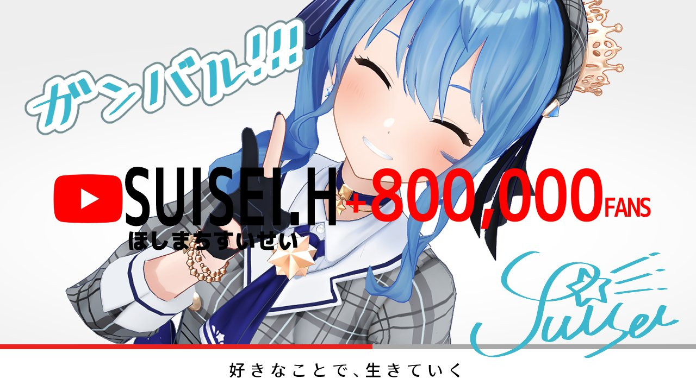
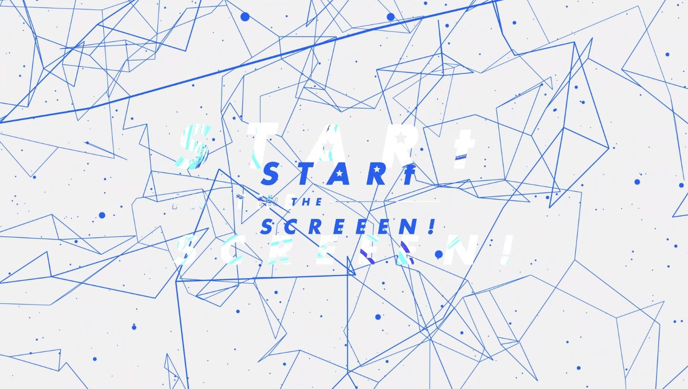
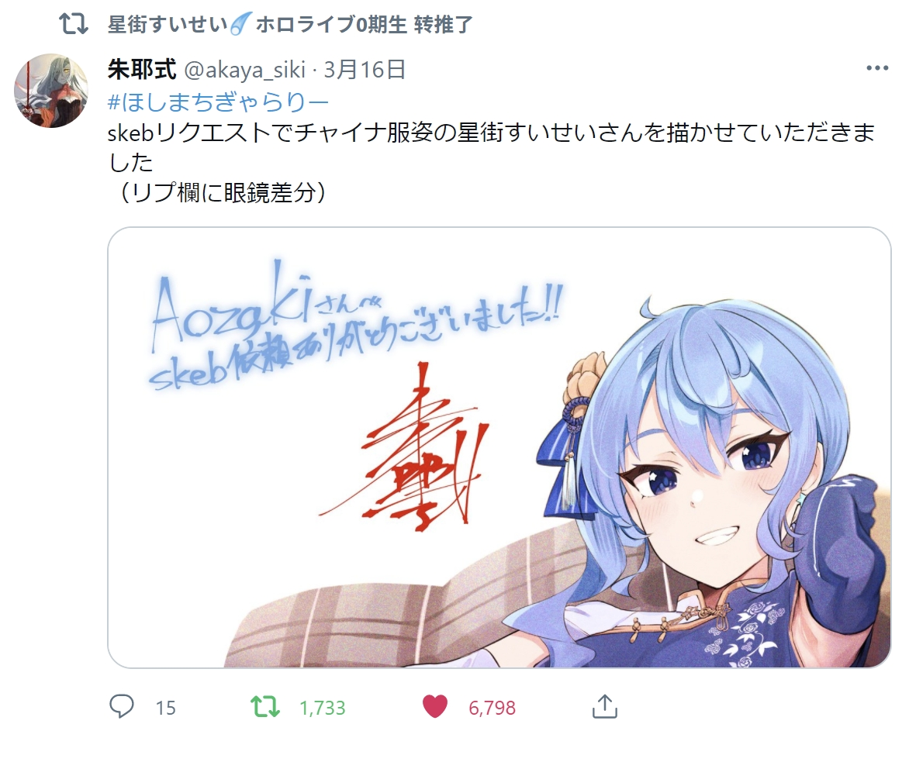



本文含有大量主观判断、私人观点、不理智行为，小心星咏者.jpg





什么都不要想，先跟我喊：**すいちゃんは？今日もかわいいー！！**



你没看错，在[上一篇](/2020/08/watching-virtual-youtuber-vtuber/)的7个月后，我依然在看VTuber。**甚至陷得更深了。**

<!--more-->

## 怎么还在看？

在经历了9月底的风波之后，国内的Hololive粉丝基本相继“脱粉”，甚至变为了anti。至于这件事情怎么来的，为什么会演化成这样，本文不想多作讨论。

不过可以说的一点是，我作为一个单推人，这事对我来说影响相当有限。我本身作为YouTube观众，且并不是我的推引发了巨大骚乱，这并不影响我继续推。

生活还在继续：上课、上班，回家打开YouTube看看她播不播…

有兴趣了打开Discord跟人吹吹水，并没什么变化嘛。

…………

真的吗？

算了，那些有的没的话还是不讲了。

---

## *STARt IN THE SCREEN !*

**

2020年6月以来星进入了一个Event Rush的状态（相关活动[点这里](#演唱会不断)）。

比较粗地统计了一下，共计11场，平均一个月至少一场。

其中一个非常重要的节点自然是[50万人纪念演唱会「*STARt IN THE SCREEN !* 」](https://www.youtube.com/watch?v=JNmmnB4bP0M)

## 嗑CP别上头



嗑CP死路一条。我准备好了，你呢？



但是我上头了，对不起。星床太香了。:tropical_drink::comet:

### 曾经的天天跌停

尽管星床早在2019年就以`#とこまち`的名义进行过数次联动，如[星床Minecraft](https://www.youtube.com/watch?v=Kr1jxq0ms00)，或是[Vあんスタ部](https://www.youtube.com/playlist?list=PLRGzS-dvI7ZwynlS-Mpf8u1HlOWaBW2wx)等活动，不过基本都是进行几次后草草收场。因此尽管不少人非常喜欢这一对唱歌超强，又是一冷一热的组合，但是因为她们一起活动的频率着实是非常低，一时间竟是天天跌停状态，能有点互相提到的机会就感觉很不错了。

此外阿床在2020年1月25日的[直播中曾经提到过星](https://youtu.be/CJD2mkpSkJs?t=4119)，彼时`Hololive 1st fes. ノンストップ・ストーリー`刚结束。当时阿星首秀选择了`天球、彗星は夜を跨いで`恐怕是至今为止最最重要的一步——她靠着NSS上的极佳表现，为她铺平了进入Hololive的道路。阿床也表示**非常尊敬、非常喜欢**阿星。

### 突然的股价回升

在沉寂了数月，并经历了在曾经明显看涨的星之彼方面前抬不起头的艰苦时代，10月突然迎来了暴涨。

阿床在[2020年10月26日的直播中](https://youtu.be/Q1t_vUj-fJQ?t=2364)宣布了`Inui Toko 1st Solo Live "who i am"`的消息，但是迟迟没等来星那天一直在说的“嬉しい告知”。但是在告知环节的最后，阿床终于揭晓谜底：

> **邀请了阿星作为演唱会嘉宾**

一时间星床人头顶青天。跨社联动本来就稀有，更何况这两人将在付费演唱会上共演。

此后更是好消息不断：1月1次的[星床电台](https://www.youtube.com/playlist?list=PLRGzS-dvI7ZyOXpMyICfMY03vMsuxbL3h)`とこまちラジオ（仮）`，并且在2020年10月31日投稿了`今宵月の館にて`作为两人首次正式合作的翻唱，并大获好评。

先前没粮，现在插了胃管灌糖。真有你们的。

### 现在的涨停板

## 做个星咏者钱包真的很受伤

你问我我去年在这个女人身上花了多少钱？我自己都算不清了。

### 演唱会不断



演唱会门票是歌手/艺人们的重要收入来源。

点名批评部分号称依然是星咏者但是将各种付费档擅自发上Bilibili的人。

你们做的这事情真的算不上是星咏者。**请勿效仿这类行为。**



**2020年星街的演唱会列表如下**

|日期|标题|付费？|
|---|---|---|
|01-24|hololive 1st fes. ノンストップ・ストーリー|✔|
|03-01|[**3Dお披露目！全編ライブ！歌って踊る姿を見てください！✨**](https://www.youtube.com/watch?v=FZnG1t34wCs)||
|03-19|ぶいおん!! SAKURA MUSIC LIVE||
|03-21|デビュー二周年&誕生日前夜祭 3DLIVE||
|06-15|ヒトカラ覗き見!?配信!||
|06-16|『音楽で日本をアゲる！』文化放送STUDIO LIVE||
|07-03|『It's a Virtual Pop World!』|✔|
|07-19|Virtual Unit Fes. VILLS vol.1|✔|
|07-25|Bilibili Marcro Link||
|08-07|Bilibili World||
|09-06|東京タワー花火大会XR  〜COSMIC FLOWER〜|✔|
|10-04|TOKYO IDOL FESTIVAL オンライン 2020 Day3|✔|
|10-19|[**STARt IN THE SCREEEN! 50万人記念ライブ**](https://www.youtube.com/watch?v=JNmmnB4bP0M&t=3298s)|
|11-22|SUISEI MUSIC “POWER” LIVE|✔|
|12-10|Inui Toko 1st Solo Live “who i am”|✔|
|12-21|hololive 2nd fes. Beyond the Stage Day2|✔|

好家伙，总共16场，其中8场付费。我都算不清我为了这些演唱会付了多少钱了（起码上千人民币）。

某种意义上说她真的挺累的，观众的钱包也相当受伤。但这是相当幸福的重伤。

### 约稿一时爽



**但是一直约稿一直爽啊。**





以下行为不建议模仿，量力而行。



自从去年11月在`skeb`上约了一张稿之后，自然体会到了什么叫做**一时约稿一时爽，一直约稿一直爽**。

出钱找人画画的感觉太棒了。

1月约了一张，3月4张。共计`58,000 JPY`，钱包真的很痛。

 

> 上图Twitter原文[点此](https://twitter.com/akaya_siki/status/1371584249745186817?s=20)。

不过我发现大部分画师都喜欢把活儿拖到最后一刻，甚至还有在最后8小时交稿的。

另外倒是因为被逼着写长文，日文进步了不少，还学了些许的敬语用法…好吧。

### 我很可爱，给我打钱

好吧这女人根本就不是说这种话的料嘛。但是她真的很可爱。

然后她对我我说了*Wow thank you, I love you!*

行吧，是我输了。

## 今年。

今年开局喜忧参半。

### 喜忧参半的开局

行吧，总不能报喜不报忧就是了。

#### 报喜

总之飘了。

##### 新年大喜利大会

1

##### Holo马车大会

1

#### 报忧

总之炸了。

##### 收益化玩炸了

1

##### 嗓子玩炸了

1

### 展望

还能有什么心愿呢。阿星一切平安，事业顺利就好。
