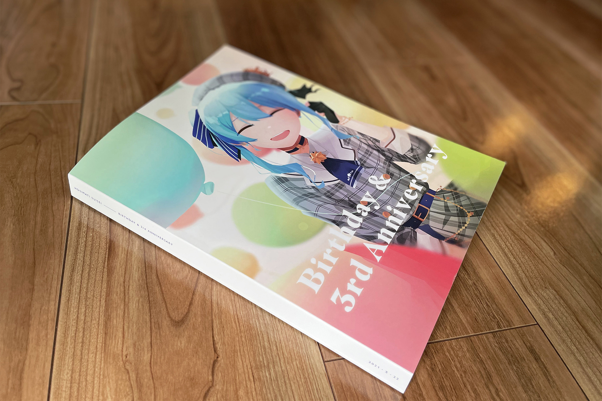



文中部分提到内容为会限内容，如感兴趣请加入[:(fab fa-youtube fa-fw):Suisei Channel](https://www.youtube.com/channel/UC5CwaMl1eIgY8h02uZw7u8A)会员。





感谢今沢老师（[:(fab fa-twitter fa-fw):@AnimarCat](https://twitter.com/AnimarCat)）绘制的阿星！



## 生日快乐！

随着时钟指向0点，星迎来了自己三周年纪念日。

从个人势到INNK，再从INNK到Hololive。在波澜万丈的2020年后迎来了2021年。

我的“追星”历也即将迎来一周年的纪念日。

在此也非常感谢[:(fab fa-twitter fa-fw):すいせいこーど](https://twitter.com/suiseicord)主催的一系列活动！不仅有幸参加了去年12月10日Inui Toko 1st Solo Live “who i am”的[星床花篮活动](https://twitter.com/suiseicord/status/1337005187123224576?s=20)，同时也参加了今年的生日留言册的活动。

> :(far fa-file-pdf fa-fw):生日留言册完整PDF点[这里](https://suiseicord.com/shikishi/3rdannv)。

我大概从1月19日就已经准备好了相关文本，并且在开始征集时立刻投稿，所以我的留言和向今沢老师约的稿就在第11~13页，紧跟Suiseicord的核心成员。

## 2021年的变化

2021年的开局正如[前一篇博文](/still-watching-vtuber-suisei-hoshimachi)所说，喜忧参半。不管是星还是观众，都迎来了各类重大变化。

### 电台

昨天（3月21日）还得知即将迎来一周年的MUSIC SPACE同时即将迎来第52周的最终回。

不过就她在会限中所说，目前文化放送在将所有VTuber相关的节目关停，因此可以看作是文化放送的战略调整。这些空出来的时间自然是可以用作休息，以及进行相关的专业练习。

由于有Pieces的先例[^1]，因此无论日本还是欧美观众均纷纷对这首歌的将来表示了担忧。会限中阿星表示“对这首歌今后会如何”也不是十分清楚。

希望这首星自己作词、对自己首个电台节目具有重大纪念意义的歌曲不会被埋没吧。

### 声线



此次是更换声线，**不是更换中之人**，星已经明确说过唱歌声线不会改变。



[:(fab fa-youtube fa-fw):2021年3月22日的凸待](https://www.youtube.com/watch?v=oPz4lrkarZ0)中，星披露了自己的新声线。

作出这一决定对她而言想必非常艰难，毕竟她用着这个声线从2018年3月22日投稿[第一个自我介绍视频](https://www.youtube.com/watch?v=1dOyVEls4pg&t=73s)开始，一路经历了那么多风风雨雨。然而她的嗓子从2020年夏天起因为不断增长的直播时间、收录工作与演唱会，已是不堪重负。为了她将来的职业生涯考虑，她不得不作出这一艰难的决定。

我突然也可以理解为什么她尽管最近嗓子状态不好，但仍然那么频繁直播——想必她是想抓住这些机会，用这个声线给观众留下美好回忆吧。

我仍然十分尊敬这个女孩。

### 关于新声线的看法

> [:(fab fa-twitter fa-fw):原文地址](https://twitter.com/suisei_hosimati/status/1373988320158523398)，建议无限循环 :(fas fa-meteor):



在直播结束后，星在推上用新声线发布了短视频再次宣布了换新声线的消息。

可以说是并不大的变化，声音稍深沉了一些，像姐街，也更偏メテオくん了（笑）

于是换完声线后我们迎来了更帅的阿星，怎么会有人拒绝帅女人呢？

因此也有不少朋友表示，这是给了我们再一次迷上她的机会。

不过昨天在路上放星的歌单时突然发现，这个声线实际上对于她的听众而言非常熟悉。

她这样的“帅”声线实际上一直在她的翻唱曲中出现，像[乱舞のメロディー](https://www.youtube.com/watch?v=LpkWFnRPd-M)、[ALICE in N.Y.](https://www.youtube.com/watch?v=Ur0K2WA67jw)，甚至[佐賀事変](https://www.youtube.com/watch?v=-wNSFmqhQsU)里，都可以听到她这样相对深沉的声线。以播放量的增长速度来看，这也是她的观众最喜欢的声线了。

 

做个事后诸葛亮：她着实不必那么担心，毕竟帅女人可能才是她的观众们最喜欢的一面。

### 更换声线的意义



本节为个人看法与推测，不代表真实情况。





原因请参考3月21日的[:(fab fa-youtube fa-fw):会限](https://www.youtube.com/watch?v=77RIG0r65qE)，本节不对内容作表述。



由于星将来的活动重心必然往音乐方面倾斜，因此更换直播声线、减轻声带负担是必然的结果。

实际上我并不像其他不少观众一样对此非常不安，相反，我长舒一口气。尽管我不是耳鼻咽喉科的医师，但是作为同行我明白一定有无数医生劝她为了将来考虑，不能再这样继续下去了。最初她表示[非常抗拒医生建议](https://www.youtube.com/watch?v=ta5_6p3fQtY)时我真的极度心焦——我真的不想看到她在理应起飞的阶段把自己最重要的嗓子毁了。

此次她下定决心，为了自己的将来作出了这个痛苦的决定，我觉得非常感动，也更尊敬她了。

尽管这一更换可能会流失部分老观众，也可能导致新观众的混乱。

更不难预想到会流传出“星街彗星中之人换了”这样的无厘头谣言。我只能对这些谣言说：**信你个鬼**。

## 希望。

祈祷最好的，同时做好最坏的打算。

祝星街彗星生日快乐，祝你职业生涯一路顺利。

[^1]: 该曲版权方可能包括Bilibili，因此在B站事件后星并无太大可能再次演唱这首歌。
