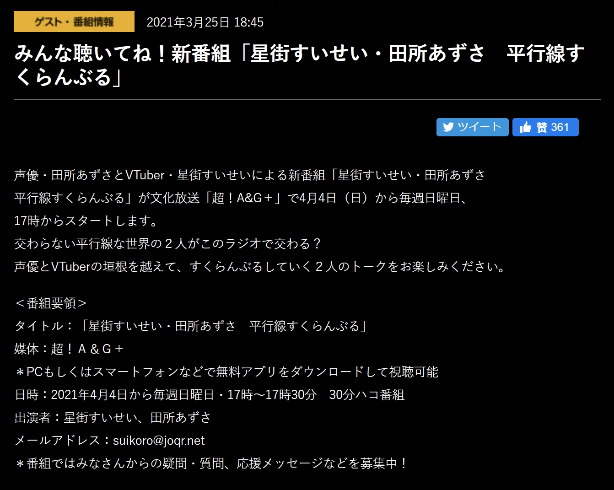

## MUSIC SPACE



MUSIC SPACE的直播存档目前仍然存活。



正如[前一篇博文](/happy-birthday-suisei/)所说，从2020年开始陪伴我们1年的MUSIC SPACE即将在2021年3月28日迎来第52期暨最终回。一年以来我们见证了星从初次上电台时的紧张，以及在和熊猫哥（[:(fab fa-twitter fa-fw): サカノウエヨースケ](https://twitter.com/sakanoueyosuke)）和他的吉他伴奏下逐渐成长的过程。

一年以来，星在熊猫哥以及所有准时收听电台的星咏者守护下，与众多嘉宾进行了合唱。除了来自Hololive的夏色まつり、天音かなた，还请来了彩虹社（にじさんじ）的[戌亥とこ](https://twitter.com/inui_toko)，Re:Act 社的[花鋏キョウ](https://twitter.com/Kyo_Hanabasami/)等等VTuber同行。甚至有幸请到了 高槻かなこ[^1]以及 成海瑠奈[^2]。

以及星自己演唱及作词、熊猫哥负责谱曲的 NOW ON SPACE!! 真的很好听。目前看来与文化放送关系不差，这首歌想必也能在今后有机会多多演唱吧。

## 平行線すくらんぶる



截止本文发布时，尚无关于电台内容以及是否有嘉宾的消息。



星在此前直播中多次暗示“一个节目结束了，也许还会有新的呢？”，并结合文化放送允许她在 VILLS Vol.2 的舞台上演唱 NOW ON SPACE!! 的事实，新节目宣布也只是时间问题。

此前的猜测包括Hololive在文化放送只谈下来一个时间段、被官方节目挤占时间、节目效果不好被砍了、她太忙了等等原因。甚至还有觉得星又被利用当作拓展事务所人气的猜测。一时间关于为何突然节目迎来最终回的原因众说纷纭。

> [:(fab fa-twitter fa-fw):田所あずさofficial](https://twitter.com/AzusaTadokoro/status/1375053223367634947) 官宣消息。

随着2021年3月25日晚新节目「平行線すくらんぶる」的官宣，这些疑惑一扫而空。档期不变，依然是每周日下午17:00 - 17:30 JST，节目变为了与 田所あずさ 的共同节目。

到这里如果有对IM@S系列熟悉的朋友可能已经尖叫出声了。

[田所あずさ](https://www.wikiwand.com/ja/田所あずさ) 正是在 アイドルマスター ミリオンライブ！ シアターデイズ[^3]中 [最上静香](https://millionlive.info/?最上静香) 的CV。

> 翻唱视频地址：[:(fab fa-youtube fa-fw):餞の鳥](https://www.youtube.com/watch?v=5yDNEmcKQFY)、[:(fab fa-youtube fa-fw):アライブファクター](https://www.youtube.com/watch?v=a9EZ2KFTbYM)

、最上静香 (CV.田所あずさ)]")

、最上静香(CV.田所あずさ)")

[^1]: [高槻かなこ](https://twitter.com/Kanako_tktk)小姐作为CV出演 ラブライブ!サンシャイン!! 中的 国木田花丸。- [Wiki](https://www.wikiwand.com/ja/高槻かなこ)

[^2]: [成海瑠奈](https://twitter.com/runanoakami)小姐在 THE IDOLM@STER SHINY COLORS 中出演 三峰結華。- [Wiki](https://www.wikiwand.com/ja/成海瑠奈)

[^3]: 即 THE IDOLM@STER MILLION LIVE! THEATER DAYS ，中译“偶像大师 百万现场 剧场时光”。
