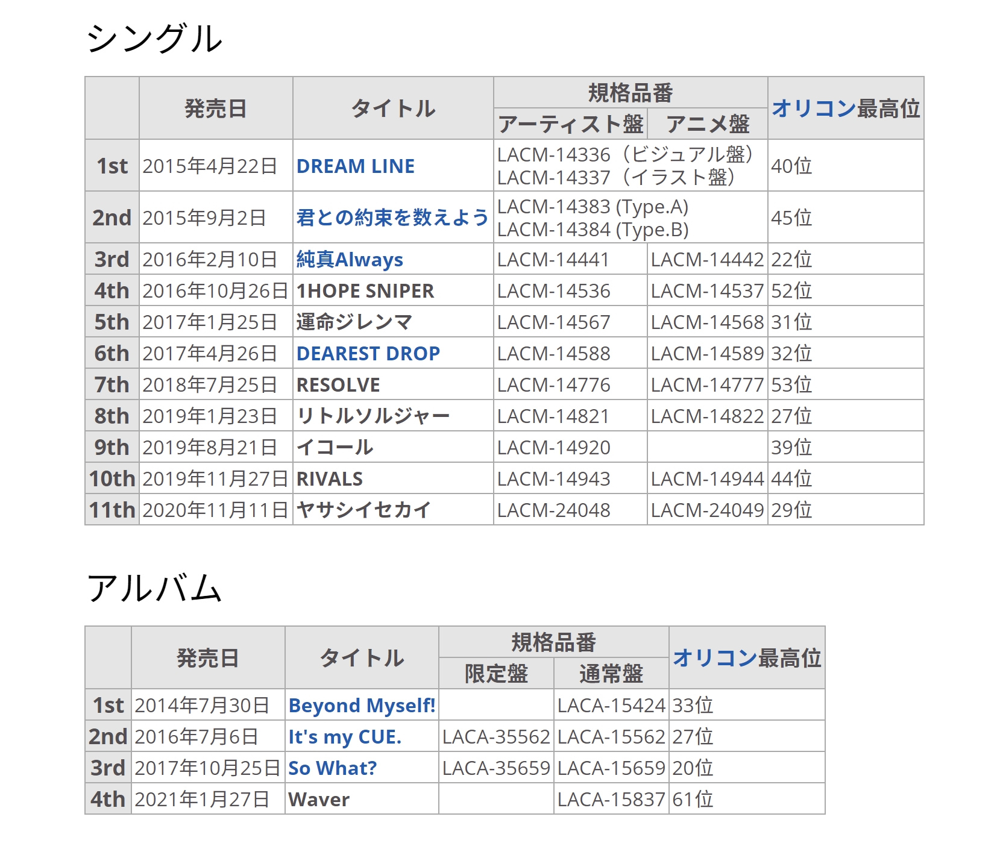

## MUSIC SPACE



MUSIC SPACE 的直播存档目前仍然存活。



正如[前一篇博文](/happy-birthday-suisei/)所说，从 2020 年开始陪伴我们 1 年的 MUSIC SPACE 即将在 2021 年 3 月 28 日迎来第 52 期暨最终回。一年以来我们见证了星从初次上电台时的紧张，以及在和熊猫哥（[:(fab fa-twitter fa-fw): サカノウエヨースケ](https://twitter.com/sakanoueyosuke)）和他的吉他伴奏下逐渐成长的过程。

一年以来，星在熊猫哥以及所有准时收听电台的星咏者守护下，与众多嘉宾进行了合唱。除了来自 Hololive 的夏色まつり、天音かなた，还请来了彩虹社（にじさんじ）的[戌亥とこ](https://twitter.com/inui_toko)，Re:Act 社的[花鋏キョウ](https://twitter.com/Kyo_Hanabasami/)等等 VTuber 同行。甚至有幸请到了 高槻かなこ[^1]以及 成海瑠奈[^2]。

以及星自己演唱及作词、熊猫哥负责谱曲的 NOW ON SPACE!! 真的很好听。目前看来与文化放送关系不差，这首歌想必也能在今后有机会多多演唱吧。

## 平行線すくらんぶる



截止本文发布时，尚无关于电台内容以及是否有嘉宾的消息。



星在此前直播中多次暗示“一个节目结束了，也许还会有新的呢？”，并结合文化放送允许她在 VILLS Vol.2 的舞台上演唱 NOW ON SPACE!! 的事实，新节目宣布也只是时间问题。

此前的猜测包括 Hololive 在文化放送只谈下来一个时间段、被官方节目挤占时间、节目效果不好被砍了、她太忙了等等原因。甚至还有觉得星又被利用当作拓展事务所人气的猜测。一时间关于为何突然节目迎来最终回的原因众说纷纭。

> [:(fab fa-twitter fa-fw):Hololive](https://twitter.com/hololivetv/status/1375327563229274112)、[:(fab fa-twitter fa-fw):田所あずさ official](https://twitter.com/AzusaTadokoro/status/1375053223367634947) 官宣消息。

随着 2021 年 3 月 25 日晚新节目「平行線すくらんぶる」的官宣，这些疑惑一扫而空。档期不变，依然是每周日下午 17:00 - 17:30 JST，节目变为了与 [田所あずさ](https://www.wikiwand.com/ja/田所あずさ) 的共同节目。

到这里如果有对 IM@S 系列熟悉的朋友可能已经尖叫出声了。

[田所あずさ](https://www.wikiwand.com/ja/田所あずさ) 正是在 アイドルマスター ミリオンライブ！ シアターデイズ[^3]中 [最上静香](https://millionlive.info/?最上静香) 的 CV。

> 翻唱视频地址：[:(fab fa-youtube fa-fw):アライブファクター](https://www.youtube.com/watch?v=a9EZ2KFTbYM)、[:(fab fa-youtube fa-fw):餞の鳥](https://www.youtube.com/watch?v=5yDNEmcKQFY)

、最上静香(CV.田所あずさ)")

、最上静香 (CV.田所あずさ)]")

非常巧合的是，星在去年已经分别与朝ノ瑠璃、ときのそら翻唱过 [アライブファクター](https://www.youtube.com/watch?v=a9EZ2KFTbYM) 与 [餞の鳥](https://www.youtube.com/watch?v=5yDNEmcKQFY) 。尤其在 [アライブファクター](https://www.youtube.com/watch?v=a9EZ2KFTbYM) 中，星翻唱了[最上静香](https://millionlive.info/?最上静香)的部分。

想必二位在最初的几回节目中一定会聊到这个话题，素来喜欢 IM@S 的星也一定会忍不住想多聊一些。

## 田所あずさ

实际上除了饰演贵为 IM@S 新御三家之一的最上静香，田所あずさ小姐在 CV 和音乐方面均颇有建树。

CV 方面：

- [アイカツ!](<https://www.wikiwand.com/ja/アイカツ!_(アニメ)>)（[霧矢あおい](http://www.aikatsu.net/03/character/05.html)）
- [終末なにしてますか? 忙しいですか? 救ってもらっていいですか?](https://www.wikiwand.com/ja/終末なにしてますか?_忙しいですか?_救ってもらっていいですか?) （ [珂朵莉](http://sukasuka-anime.com/chara/chtholly.html) ）
- [明日方舟](https://www.wikiwand.com/ja/アークナイツ)（[德克萨斯](https://kokodayo.fun/details/char_102_texas)、[克洛斯](https://kokodayo.fun/details/char_124_kroos)）
- [ウマ娘 プリティーダービー](https://www.wikiwand.com/ja/ウマ娘_プリティーダービー)（[シンボリルドルフ](https://umamusume.jp/character/detail/?name=symbolirudolf)）

不仅如此，她也已经成功举办了**10 场**个人演唱会，这对于星来说想必也是梦寐以求的目标吧。

## 其他须知

电台「星街すいせい・田所あずさ　平行線すくらんぶる」在 [超！A&G+](http://agqr.jp/)，每周日 17:00-17:30 JST 开播。第一次直播将在 2021 年 4 月 4 日开始。Hashtag 是`#線すく`。

非常期待星和あずさ能够擦出怎样的火花……！熊猫哥会不会继续出现呢！

[^1]: [高槻かなこ](https://twitter.com/Kanako_tktk)小姐作为 CV 出演 ラブライブ!サンシャイン!! 中的 国木田花丸。- [Wiki](https://www.wikiwand.com/ja/高槻かなこ)
[^2]: [成海瑠奈](https://twitter.com/runanoakami)小姐在 THE IDOLM@STER SHINY COLORS 中出演 三峰結華。- [Wiki](https://www.wikiwand.com/ja/成海瑠奈)
[^3]: 即 THE IDOLM@STER MILLION LIVE! THEATER DAYS ，中译“偶像大师 百万现场 剧场时光”。
