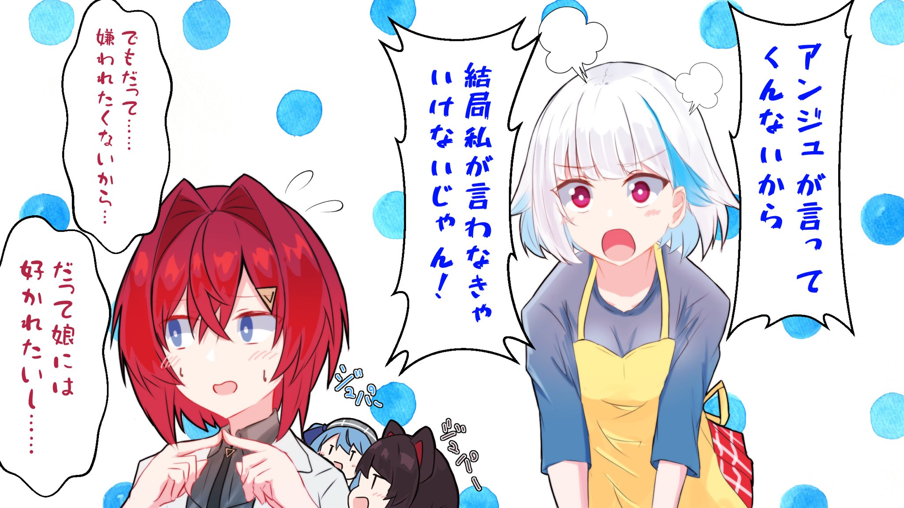



尽管本文为NovaDNG老师向我约的稿，但我承认本文私货相当之多，请谨慎阅读。:tropical_drink::comet:





切记，**嗑真人CP死路一条**，请勿上头。





本文含有大量主观判断、私人观点、不理智行为。



## 前言

本文是 [:(fab fa-twitter fa-fw):NovaDNG老师](https://twitter.com/NovaDNG) 在2021年3月26日晚看完 [:(fab fa-youtube fa-fw):星床电台#6](https://www.youtube.com/watch?v=nlkJdUZU5Ws) 后一时兴起，向我约的稿。本身我也有将星床组合的历史进行梳理的打算，于是便有了这篇文章。话是这么说，我还是会尽量压制私货数量并尽量集中到最后。如果读者觉得私货还是太多，那只能怪Nova老师这么约的了。

不过还是要重申那个问题，**嗑真人CP死路一条**，请勿上头。

## 组合名

星床（とこまち）这个组合名来自于两人的名字，即：

 

いぬい<b>とこ</b> + ほし<b>まち</b>すいせい = <b>とこ</b><b>まち</b>

 

由于 戌亥とこ 的官方中文译名为“戌亥床”，按照顺序应该译作“床星”，亦有部分社区称之为“病床”（即 精神**病** + 戌亥**床**）。但是以往社区约定俗成的译名以及个人偏好，本文仍翻作“星床”。

目前可以在[Twitter上搜索到的](https://twitter.com/search?q=とこまち(from:suisei_hosimati)&src=typed_query&f=live)、第一次出现`#とこまち`的时间点是2019年6月26日[首次Minecraft联动](https://www.youtube.com/watch?v=Kr1jxq0ms00)。（当然阿星把推しマーク打错了，不是:dog:是:tropical_drink:啊喂！）

此后随着2020年10月27日宣布的`とこまちラジオ（仮）`，这个组合名也正式固定了下来。

## 初识



相关时间点及事件采编自公开、可查证的来源，主要包括Twitter账户及YouTube公开影片，下同。



2019年5月19日，星正式加入INNK（イノナかミュージック）。随即获得了众多VTuber和熟人的祝贺，其中包括刚刚**出道三3月**[^1]的阿床。这时已经能看出阿床非常喜欢阿星的歌声了（尽管阿床的歌声也非常吸引人，和Aimer非常像，这则是后话了）。

> 凸待完整对话请见[:(fab fa-youtube fa-fw):阿床凸待](https://www.youtube.com/watch?v=RWeFaZK1PfE&t=4305s)。

在

## 相处

## 圆梦

### 星床电台

### 翻唱

### 演唱会

## 2021年

## 私货 / 我为什么那么喜欢星床

[^1]: 阿星3月22日正式出道，阿床以及安洁、皇女也是在3月22日出道（发表第一则推文）。
