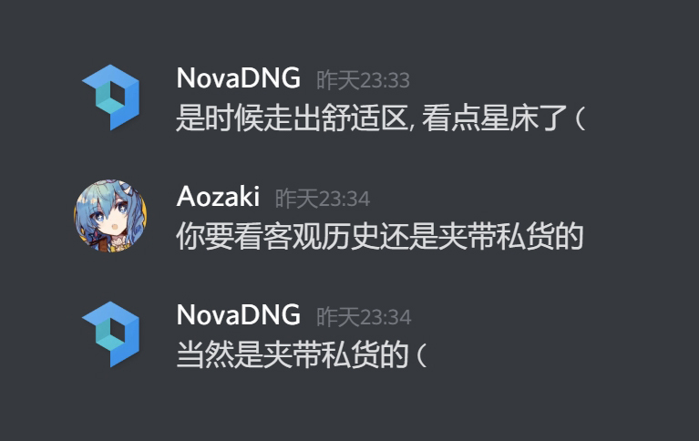
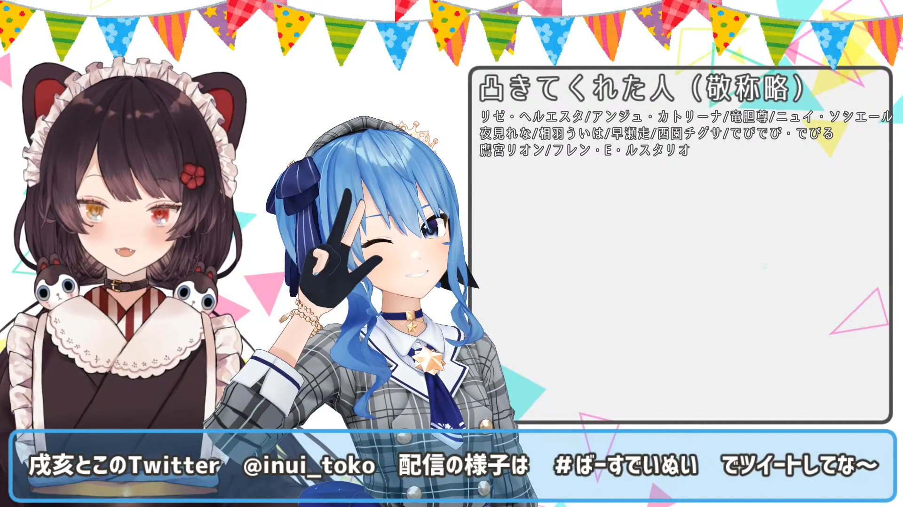
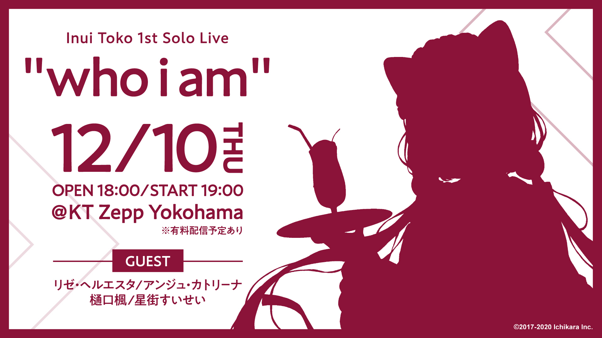
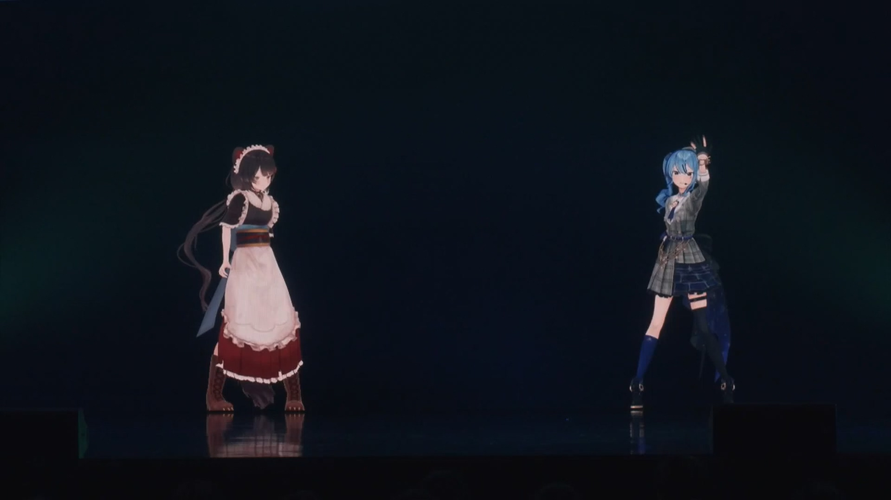
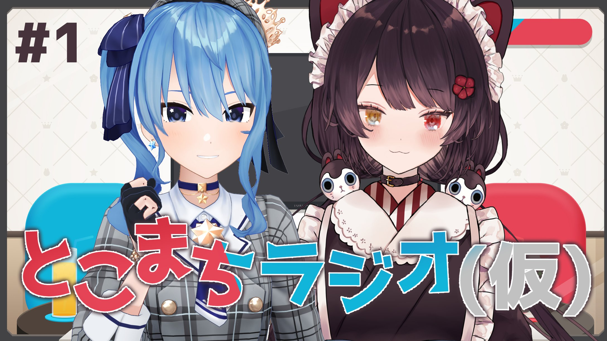
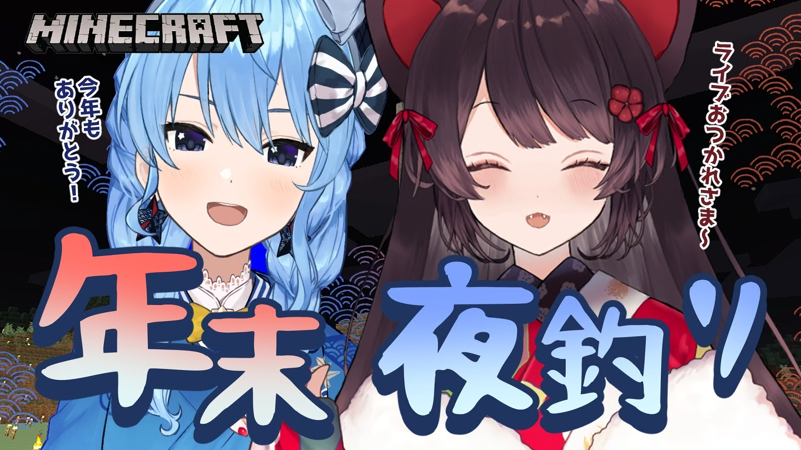
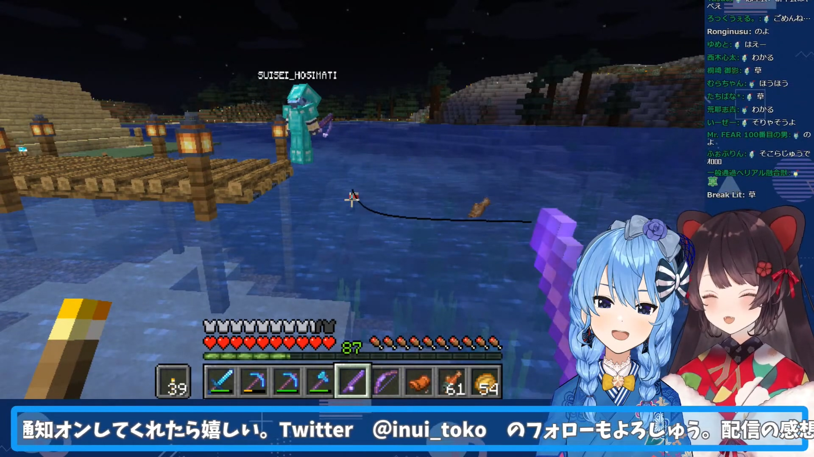



尽管本文为NovaDNG老师向我约的稿，但我承认本文私货相当之多，请谨慎阅读。:tropical_drink::comet:





切记，**嗑真人CP死路一条**，请勿上头。





本文含有大量主观判断、私人观点、不理智行为。



## 前言

本文是 [:(fab fa-twitter fa-fw):NovaDNG老师](https://twitter.com/NovaDNG) 在2021年3月26日晚看完 [:(fab fa-youtube fa-fw):星床电台#6](https://www.youtube.com/watch?v=nlkJdUZU5Ws) 后一时兴起，向我约的稿。本身我也有将星床组合的历史进行梳理的打算，于是便有了这篇文章。话是这么说，我还是会尽量压制私货数量并尽量集中到最后。如果读者觉得私货还是太多，那只能怪Nova老师这么约的了。

不过还是要重申那个问题，**嗑真人CP死路一条**，请勿上头。

此外本文实验性地引用了Twitter和YouTube的嵌入式框架，如加载不出，请自行准备相应方法。

<!--more-->

***

## 组合名

星床（とこまち）这个组合名来自于两人的名字，即：

 

いぬい<b>とこ</b> + ほし<b>まち</b>すいせい = <b>とこ</b><b>まち</b>

 

由于 戌亥とこ 的官方中文译名为“戌亥床”，按照顺序应该译作“床星”，亦有部分社区称之为“病床”（即 精神**病** + 戌亥**床**）。但是以往社区约定俗成的译名以及个人偏好，本文仍翻作“星床”。



目前可以在[Twitter上搜索到的](https://twitter.com/search?q=とこまち(from:suisei_hosimati)&src=typed_query&f=live)、第一次出现`#とこまち`的时间点是2019年6月26日[首次Minecraft联动](https://www.youtube.com/watch?v=Kr1jxq0ms00)。（当然阿星把推しマーク打错了，不是:dog:是:tropical_drink:啊喂！）

此后随着2020年10月27日宣布的`とこまちラジオ（仮）`，这个组合名也正式固定了下来。

由于「まち」与「待ち」同音，因此在星床联动待机所，观众通常都会使用 とこまち:tropical_drink::comet: 及其变体。

***

## 初识



相关时间点及事件采编自公开、可查证的来源，主要包括Twitter账户及YouTube公开影片，下同。





2019年5月19日，星正式加入INNK（イノナかミュージック）。随即获得了众多VTuber和熟人的祝贺，其中包括刚刚**出道三3月**[^1]的阿床。这时已经能看出阿床非常喜欢阿星的歌声了（尽管阿床的歌声也非常吸引人，和Aimer非常像，这则是后话了）。

> 凸待完整对话请见[:(fab fa-youtube fa-fw):阿床生日凸待](https://www.youtube.com/watch?v=RWeFaZK1PfE&t=4305s)。

2020年9月9日，在阿床生日凸待上，阿星打进了电话。

两人自然而然谈及了当时认识的契机：有“某人”介绍了这两位ES狂热粉丝认识。然而问及第一印象时，两人的回答均令人捧腹：

> :comet:：にじさんじの最近よく見かけのなんかちょっと**和風な女**…
> 
> :tropical_drink:：（前略）お歌聞いた時に、ふーん、**歌うめぇ女**～

两人也谈到了想一起投翻唱，想一起在Live house唱歌…

这一说便是等了好久，一直沉寂到10月底，两人的梦想逐渐开始成真。

***

## 圆梦



阿床在2020年1月25日的[直播中曾经提到过星](https://youtu.be/CJD2mkpSkJs?t=4119)，彼时`Hololive 1st fes. ノンストップ・ストーリー`刚结束。当时阿星首秀选择了`天球、彗星は夜を跨いで`恐怕是至今为止最最重要的一步——她靠着NSS上的极佳表现，为她铺平了进入Hololive的道路。阿床也表示**非常尊敬、非常喜欢**阿星。

然而自从3月两人投稿「砂上ノ楼閣」，以及进行了一次[界限化夜钓](https://www.youtube.com/watch?v=bwAXmu5uYes)后，面上活动陷入了停滞。除了寥寥几次发推互动以外，~~星床股票陷入了持续跌停~~。尽管不少人和我一样非常喜欢这一对唱歌超强，又是一冷一热的组合，但是因为她们一起活动的频率着实是非常低，一时间竟是天天跌停状态，能有点互相提到的机会就感觉很不错了。

### 演唱会

阿床在[2020年10月26日的直播中](https://youtu.be/Q1t_vUj-fJQ?t=2364)宣布了`Inui Toko 1st Solo Live “who i am”`的消息，但是迟迟没等来星那天一直在说的“嬉しい告知”。但是在告知环节的最后，阿床终于揭晓谜底：

> **邀请了阿星作为演唱会嘉宾**

一时间星床人头顶青天。跨社联动本来就稀有，更何况这两人将在付费演唱会上共演。

而在为期近一个月的紧张准备后两人也是交出了令人非常满意的答卷。

<!--演唱会点评-->

2020年12月10日，阿床的1st个人演唱会在 Zepp Yokohama 拉开帷幕。

星是第二位登场的嘉宾，但是MC仿佛与阿床说相声一般wwww

期间提到了两人在完全没碰面的情况下买了几乎同样的补给，以及以同样的想法买了比平时小一号的瓶装水。甚至提到了两人标志性的笑声也出现了互换现象。阿星的笑声似乎更多出现在日常生活中，甚至在大街上发出了一声特别有穿透力的`アハー⤴︎`，甚至惨遭阿床吐槽“这比我的啊哈⤴︎有气势太多了”；阿床的话则是最近的小声笑都变成了星的风格，而在星床电台中，阿床大爆笑时也发出了`イヒヒヒヒヒ`的笑声。~~都说互相喜欢的人笑声会越变越像，所以星床是真的！~~

而两人的选曲也是不出意外，两首均出自于偶像梦幻祭[^2]，分别是「BREAKTHROUGH!」与「翼モラトリアム」。

两人不仅以稳健又极具穿透力的歌声演唱，并且完整复刻了原MV中的舞蹈。不仅以超高质量迷倒了大批观众，也让尊妈[^3]和其他参演人员惊叹。

> 原曲MV地址：[:(fab fa-youtube fa-fw):BREAKTHROUGH!](https://www.youtube.com/watch?v=IR7JEJUcM4w)、[:(fab fa-youtube fa-fw):翼モラトリアム](https://www.youtube.com/watch?v=CrVIEFM791Y)

<!--感想会-->

在感想会中，尊妈问及两人是如何选曲的，两人当即答道是一起去卡拉OK实际唱过决定的，引得リゼ也不禁感叹。（难道大部分人都是没唱过就选曲了吗…）至于尝试完整复刻MV的舞蹈，两人则承认低估了难度。两人花了相当长的时间一起训练才达到了舞台上呈现出来的结果。

阿床也在感想会中提到，在宣布演唱会的消息后和阿星呆在一起的时间甚至远超Ange和Lize。两人从早到晚一起练舞、练歌，一起吃饭，最后甚至连笑声都越变越像了。~~这是在自己小姐妹和尊敬地前辈面前面前宣布正妻？~~

### 星床电台

<!--电台概况与趣事-->

作为两人圆梦的一步，星床电台从2020年10月28日起每月第四个周三准时播出，目前已到了`#6`（满半年啦！）

尽管电台一直被吐槽ES浓度过高像极了非公式专题节目，两人还是在节目的各个环节中制造了不少大爆笑环节。其中之一便是著名的「音割れロミオ と 爆笑ジュリエット」



两人也是通过节目中的环节不停地尝试证明自己特别了解对方（当然也有强行说答对的情况）。

<!--各种闪光弹-->

### 翻唱



<!--至今三个翻唱以及感想-->

<!--还是想听更多翻唱和歌回-->

***

## 杂谈

除了音乐与综艺这些大主线，两人在日常生活和直播中的小细节也非常可爱。

### あんスタ



且不说这两人第一次在演唱会上联唱就全部选的ES曲子，平时也是重氪金一把好手。两人曾经约定在2020年3月9日把直播翘掉，只为了能够第一时间玩上当日开始运营的`あんさんぶるスターズ！！`。只可惜因为新冠的原因（大概），开始运营时间延期，两人过于伤心于是一起去了卡拉OK**热唱8小时**（无直播无存档）。

之后ES正式开始运营后，两人也在[推上投稿了「砂上ノ楼閣」](https://twitter.com/suisei_hosimati/status/1239146084712083456)作为纪念。

而星床电台的`#1`至`#4`也是非常彻头彻尾的ES非官方放送，一直到`#5`开始请嘉宾才得到改善（？）。

### 自我介绍

这两人常年交换自己的所属公司开玩笑，在[阿床生日凸待](https://www.youtube.com/watch?v=RWeFaZK1PfE&t=4305s)中星一打进电话就说“啊我是彩虹社所属的虚拟偶像星街彗星…”，把阿床吓得忙说：“欸？别因为我引发外交问题啊。”于是阿星也赶紧改口把正确的所属和自我介绍讲了一遍。

而早在2019年的[星床联动（Minecraft）](https://www.youtube.com/watch?v=Kr1jxq0ms00)中两人也互换自我介绍开玩笑，甚至玩了一把`君の名は`的梗：

> 「「これってもしかして、俺たち・私たち、入れ替わってるー！？」」

在阿床演唱会时，登场后迅速拿所属开了玩笑。阿星故作迟疑说“啊我不是彩虹社，是Hololive的来着…”，阿床也故作惊讶，更是体现了跨社联动的不易。

### 日常生活

> 星床年末夜钓：[:(fab fa-youtube fa-fw):阿星视角:comet:](https://www.youtube.com/watch?v=U5YCqWyIY6Q)、[:(fab fa-youtube fa-fw):阿床视角:tropical_drink:](https://www.youtube.com/watch?v=SyiZD22NVeY)

在2020年12月31日，两人选择一起MC夜钓度过这不平凡的一年的最后一天。

直播中两人一边嬉闹一边回顾了这整整一年。阿星的答案和电台中说的一样，选择了「奔」这个字。

此外两人也提到了很多有意思的点：

  - 2020年星和床玩的时间可能是**最久的**
  - “和阿床比起去年关系好了100倍！”
  - 星平时喜欢穿高跟鞋显腿长，但特别容易摔
  - 阿床和星逛街一直走在后面，一直看着阿星防止星摔倒（真不是男友吗）
  - 两人的兴趣、喜欢的东西、想做的事情、喜欢吃的东西都几乎一样
  - 和阿星出门想吃什么基本是秒决定（反正都是烤肉、家庭餐厅、涮涮锅[^4]三选一）

另外两人也提到在自己的原创曲歌词的巧合：

> 地獄屋八丁荒らし：あしたてんきになあれ
>
> NEXT COLOR PLANET：明日は晴れるから

两句歌词的旋律和意义也很相似，甚至MC里的天气也非常配合地转晴了。

夜钓中两人的视角也印证了上文第四点：阿星上蹿下跳地钓鱼，而阿床一直在看着阿星一边聊天。

阿床你就宠着星吧！好好宠着她别让她摔了啊。:tropical_drink::comet:

***

## 2021年

<!--ひま食堂3D联动-->

<!--电台新guest-->

<!--一点点希望-->



どんな試練も
 
越えていけるさ

友情っていう勇気となら



***

## 私货 / 我为什么那么喜欢星床



以下全文私货。





~~什么，说真的读到这里你还要问我为什么喜欢星床？~~

不如我们来看看她们有多喜欢对方。

<!--阿星切片-->

<!--阿床切片-->

所以民政局早就搬过来了，二位什么时候结婚？

[^1]: 阿星3月22日正式出道，阿床以及安洁、皇女也是在3月22日出道（发表第一则推文）。

[^2]: 即：あんさんぶるスターズ！！，简称あんスタ。

[^3]: 即：竜胆尊 - [:(fab fa-twitter fa-fw):Twitter](https://twitter.com/rindoumikoto)

[^4]: 即：しゃぶしゃぶ - [:(fab fa-wikipedia-w fa-fw):涮涮鍋](https://www.wikiwand.com/zh/涮涮鍋)
